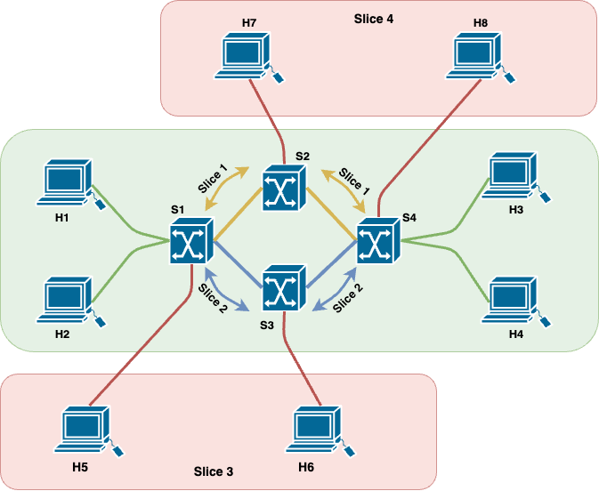
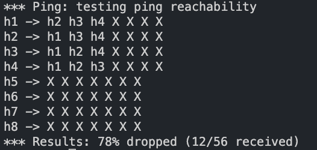
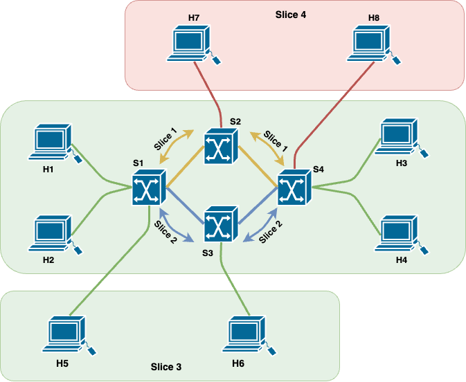
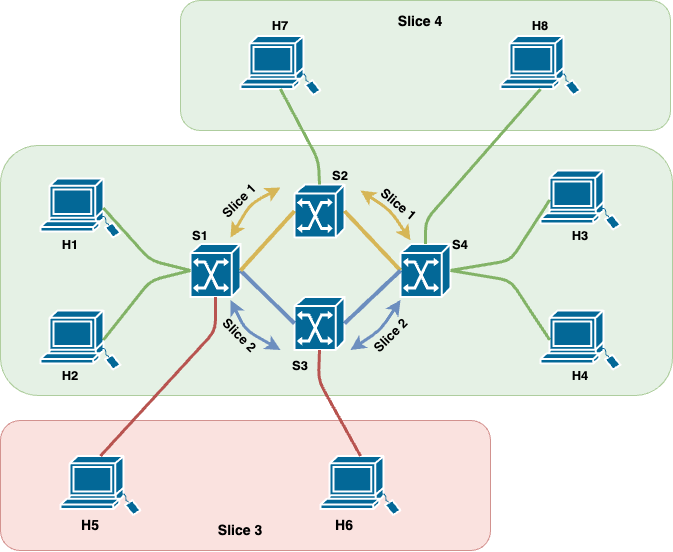
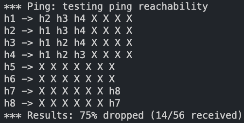
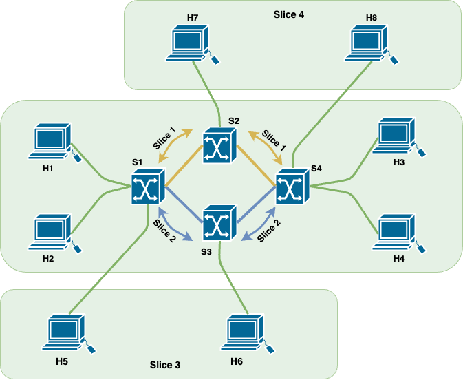

# SDN Slices in ComNetsEmu

------

## Table of contents

- [Introduction](#introduction)
- [Scenario 1 - Default](#scenario-1---default)
- [Scenario 2 - Lower](#scenario-2---Lower)
- [Scenario 3 - Upper](#scenario-1---Upper)
- [Scenario 4 - Total](#scenario-1---Total)
- [Run the demo](#Run-the-demo)

# Introduction

The objective of this project is to develop a network slicing method that allows for the flexible activation and deactivation of network slices using command line interface (CLI) or graphical user interface (GUI) commands. To accomplish this objective, five scenarios have been suggested, all utilizing the same network structure. The aim is to examine the network's behavior when various components of the network undergo minor or major modifications.

The network topology is organized as follow:

- A SDN controller `c1`.
- Four switches `s1-s2-s3-s4` with a variable bandwith.
- Four slices, two service slices and two topology services. These slices contain 8 hosts `h1-h2-h3-h4-h5-h6-h7-h8`.

# Scenario 1 - Default

In this scenario, there are four hosts and four switches. The four hosts are connected with two service slices. One slice is for Video transmission (UDP protocol) and use switches: `s1-s2-s4` with a maximum bandwith of 10 Mbits/sec. The other' slice is for No-Video transmission (TCP and ICMP protocols) and use switches: `s1-s3-s4` with a maximum bandwith of 8 Mbits/sec.

The command `pingall` in mininet test connectivity between all hosts in a network. In this scenario we can see that only the four host `h1-h2-h3-h4` can see each other.

In addition, to verify the accuracy of the network bandwidth, you can check the bandwidth  between two hosts via `iperf <host1> <host2>` command and b.

# Scenario 2 - Lower

In this scenario, there are six hosts and four switches. Hosts `h1-h2-h3-h4` are connected with two service slices, while hosts `h5-h6` are connected with a topology slice. The slice for Video transmission (UDP protocol) uses a maximum bandwidth of 10 Mbit/sec. However, now the slice for no-Video (TCP and ICMP protocols) has to share the bandwidth with the topology slice, therefore the service slice no-Video take a maximum bandwidth of 3 Mbit/sec and topology slice take a maximum bandwidth of 5 Mbit/sec.

The command `pingall` in mininet test connectivity between all hosts in a network. In this scenario we can see that the four host `h1-h2-h3-h4` can see each other and also the couple `h5-h6`.

# Scenario 3 - Upper

In this scenario, there are six hosts and four switches. Hosts `h1-h2-h3-h4` are connected with two service slice, while hosts `h7-h8` are connected with a topology slice. The slice for no-Video transmission (TCP and ICMP protocols) uses a maximum bandwidth of 10 Mbit/sec. However, now the slice for Video (UDP protocol) has to share the bandwidth with the topology slice, therefore the service slice no-Video take a maximum bandwidth of 6 Mbit/sec and topology slice take a maximum bandwidth of 4 Mbit/sec.

The command `pingall` in mininet test connectivity between all hosts in a network. In this scenario we can see that the four host `h1-h2-h3-h4` can see each other and also the couple `h7-h8`.

# Scenario 4 - Total

In this scenario, there are all the eight hosts and four switches. Hosts `h1-h2-h3-h4` are connected with two service slices, while hosts couples`h5-h6` and `h7-h8` are connected with two different topology slice. the slice for Video (UDP protocol) has to share the bandwidth with the topology slice, therefore the service slice no-Video take a maximum bandwidth of 6 Mbit/sec and topology slice take a maximum bandwidth of 4 Mbit/sec. Now, also the slice for Video (UDP protocol) has to share the bandwidth with the topology slice, therefore the service slice no-Video take a maximum bandwidth of 6 Mbit/sec and topology slice take a maximum bandwidth of 4 Mbit/sec.

 

The command `pingall` in mininet test connectivity between all hosts in a network. In this scenario we can see that the four host `h1-h2-h3-h4` can see each other and also the couple `h5-h6` and `h7-h8`.

# Run the demo

Firstly install the virtual machine, follow the instruction available at this [link](https://www.granelli-lab.org/researches/relevant-projects/comnetsemu-labs).

