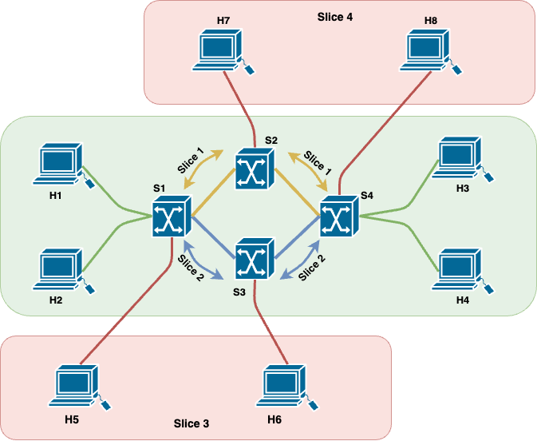

# SDN Slices in ComNetsEmu

------

## Table of contents

- [Introduction](#introduction)
- [Scenario 1 - Default](#scenario-1---default)

# Introduction

The objective of this project is to develop a network slicing method that allows for the flexible activation and deactivation of network slices using command line interface (CLI) or graphical user interface (GUI) commands. To accomplish this objective, five scenarios have been suggested, all utilizing the same network structure. The aim is to examine the network's behavior when various components of the network undergo minor or major modifications.

The network topology is organized as follow:

- A SDN controller `c1`.
- Four switches `s1-s2-s3-s4` with a variable bandwith.
- Four slices, two service slices and two topology services.

# Scenario 1 - Default

In this scenario, there are four hosts and four switches. The four hosts are connected with two service slices. One slice is for Video transmission (UDP protocol) and use switches: `s1-s2-s4` with a maximum bandwith of 10 Mbits/sec. The other' slice is for No-Video transmission (TCP and ICMP protocols) and use switches: `s1-s3-s4` with a maximum bandwith of 8 Mbits/sec.

