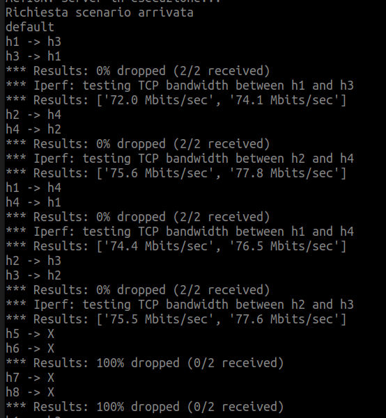
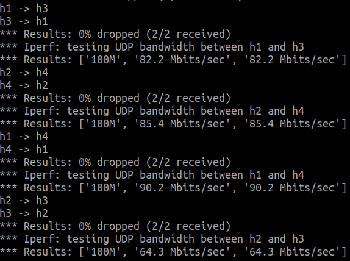
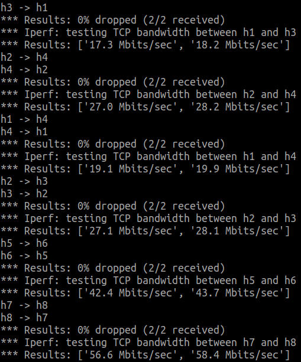

# OnDemand SDN Slicing using ComNetsEmu

<div>
        
        
        
        
        
</div>

## Table of contents

- [Introduction](#introduction)
- [Scenario 1 - Default](#scenario-1---default)
- [Scenario 2 - Lower](#scenario-2---Lower)
- [Scenario 3 - Upper](#scenario-1---Upper)
- [Scenario 4 - Total](#scenario-1---Total)
- [Run the demo](#Run-the-demo)
- [Other resources](#Other-resources)


# Introduction

The objective of this project is to develop a network slicing method that allows for the flexible activation and deactivation of network slices using command line interface (CLI) or graphical user interface (GUI) commands. To accomplish this objective, five scenarios have been suggested, all utilizing the same network structure. The aim is to examine the network's behavior when various components of the network undergo minor or major modifications.

The network topology is organized as follow:

- A SDN controller `c1`.
- Four switches `s1-s2-s3-s4` with a variable bandwith.
- Four slices, two service slices and two topology services. These slices contain 8 hosts `h1-h2-h3-h4-h5-h6-h7-h8`.

# Scenario 1 - Default

In this scenario, there are four hosts and four switches. The four hosts are connected with two service slices. One slice is for Video transmission (UDP protocol) and use switches: `s1-s2-s4` with a maximum bandwith of 10 Mbits/sec. The other' slice is for No-Video transmission (TCP and ICMP protocols) and use switches: `s1-s3-s4` with a maximum bandwith of 8 Mbits/sec.


The command `pingall` in mininet test connectivity between all hosts in a network. In this scenario we can see that only the four host `h1-h2-h3-h4` can see each other.


Using iperf we can check the bandwidth among the hosts:





# Scenario 2 - Lower

In this scenario, there are six hosts and four switches. Hosts `h1-h2-h3-h4` are connected with two service slices, while hosts `h5-h6` are connected with a topology slice. The slice for Video transmission (UDP protocol) uses a maximum bandwidth of 10 Mbit/sec. However, now the slice for no-Video (TCP and ICMP protocols) has to share the bandwidth with the topology slice, therefore the service slice no-Video take a maximum bandwidth of 3 Mbit/sec and topology slice take a maximum bandwidth of 5 Mbit/sec.


The command `pingall` in mininet test connectivity between all hosts in a network. In this scenario we can see that the four host `h1-h2-h3-h4` can see each other and also the couple `h5-h6`.


Using iperf we can check the bandwidth among the hosts:


# Scenario 3 - Upper

In this scenario, there are six hosts and four switches. Hosts `h1-h2-h3-h4` are connected with two service slice, while hosts `h7-h8` are connected with a topology slice. The slice for no-Video transmission (TCP and ICMP protocols) uses a maximum bandwidth of 10 Mbit/sec. However, now the slice for Video (UDP protocol) has to share the bandwidth with the topology slice, therefore the service slice no-Video take a maximum bandwidth of 6 Mbit/sec and topology slice take a maximum bandwidth of 4 Mbit/sec.


The command `pingall` in mininet test connectivity between all hosts in a network. In this scenario we can see that the four host `h1-h2-h3-h4` can see each other and also the couple `h7-h8`.


Using iperf we can check the bandwidth among the hosts:


# Scenario 4 - Total

In this scenario, there are all the eight hosts and four switches. Hosts `h1-h2-h3-h4` are connected with two service slices, while hosts couples`h5-h6` and `h7-h8` are connected with two different topology slice. the slice for Video (UDP protocol) has to share the bandwidth with the topology slice, therefore the service slice no-Video take a maximum bandwidth of 6 Mbit/sec and topology slice take a maximum bandwidth of 4 Mbit/sec. Now, also the slice for Video (UDP protocol) has to share the bandwidth with the topology slice, therefore the service slice no-Video take a maximum bandwidth of 6 Mbit/sec and topology slice take a maximum bandwidth of 4 Mbit/sec.

 

The command `pingall` in mininet test connectivity between all hosts in a network. In this scenario we can see that the four host `h1-h2-h3-h4` can see each other and also the couple `h5-h6` and `h7-h8`.


Using iperf we can check the bandwidth among the hosts:




## Setup the virtual machine

Firstly, install the virtual machine, follow the instruction available at this [link](https://www.granelli-lab.org/researches/relevant-projects/comnetsemu-labs).

In order to be able to see the webapp in your favourite browser you need to create a private network between the Virtual Machine and your local machine. To achieve this you have to:

1. Go to comnetsemu installation folder

```BASH
~$ cd <comnetsemu_location>
```

2. Once you are in the directory you can perform an `ls` and you should see the `Vagrantfile`. From here open it with your favourite text editor and copy this line in the file to create the private network

```BASH
config.vm.network "private_network", ip: "192.168.56.2"
```

Now this ip address is assigned to the vagrant machine and now we can see the visualizer through the browser.


# Run the demo


To run this demo, follow these steps:

1. Open the first terminal window for the controller.

2. Start the network controller by running the following command:

   ```
   ryu-manager controller.py
   ```

   Ensure that the `controller.py` file is in the same directory or provide the correct path to the file.

3.  Keep the first terminal window open and running to maintain the network controller.

4. Open the second terminal window for the rest of the network, and start the network by running the following command:

   ```
   sudo python3 topology.py
   ```


5. After initialization, you will be presented with a menu in the second terminal window. This menu will provide options to interact with the network and perform various actions.

# Other resources
[Here](https://docs.google.com/presentation/d/1P4L3OXiTjbjbKXjkgbwRyr3ogbSTaADz2g9WrZwvQgw/edit?usp=sharing) you can find the presentation of the project.

You can contact us:

| Team Member | Contacts | GitHub |
| --------- | --------- | --------- |
|  Stefano Bonetto   | stefano.bonetto@studenti.unitn.it    | [github.com/stefanoobonetto](https://github.com/stefanoobonetto)    |
| Simone Roman    | simone.roman@studenti.unitn.it    | [github.com/Sro553](https://github.com/Sro552)    |
| Mattia Rigon    | mattia.rigon@studenti.unitn.it    | [github.com/MattiaRigon](https://github.com/MattiaRigon)    |


